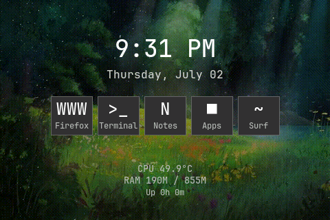

# Pi AI Node — 3.5" SPI Display + Edge AI

Evolved from the CYD-Phone hackathon project.

## Overview

Full-stack Raspberry Pi project: driving a 3.5" SPI display (Gowin FPGA → ILI9486) via the kernel's DRM driver, with a Tkinter homescreen, touch calibration, animated wallpaper, and a planned upgrade to a **Raspberry Pi 5 (16 GB)** for fully local, cloud-free AI inference.

## Project Structure

```
pi/
├── desktop-panel.py          # Tkinter homescreen (clock, shortcuts, stats, animated GIF)
├── dt-overlay/
│   └── rpi-lcd-35-dc.dts     # Device Tree overlay for ILI9486 (DC=GPIO24, 4-wire SPI)
├── config/
│   ├── config.txt            # Deployed Pi config.txt
│   ├── openbox-autostart.sh  # Openbox autostart (touch cal, compositor, panels)
│   ├── picom.conf            # Picom compositor config
│   ├── Xresources            # URxvt colors/font/geometry
│   └── autostart             # Desktop panel autostart
└── scripts/
    ├── start-desktop.sh      # Boot flow (network → DRM → X)
    ├── calibrate-touch.py    # 4-corner touch calibration (libinput matrix)
    └── live-glass.sh         # Aesthetic glass overlay script
```

## Hardware

| Component | Detail |
|-----------|--------|
| **Pi** | 3B (upgrading to Pi 5 16 GB) |
| **Display** | 3.5" SPI, 480×320, Gowin FPGA → ILI9486 |
| **Touch** | ADS7846 resistive (SPI CE1) |
| **Stack** | Pi OS (DietPi/Trixie, aarch64), Xorg/modesetting, Openbox, Tkinter |

## Current Features

- **4-wire SPI + DC pin (GPIO 24)** — kernel `ili9486.ko` DRM driver
- **Touch calibration** — 6-parameter affine transform via libinput
- **Desktop panel** — animated rain GIF wallpaper, glass clock, app shortcuts, live CPU/RAM/uptime stats
- **Boot flow** — waits for network (Ethernet/WiFi), then DRM device, then startx
- **Compositor** — picom with blur + opacity (xrender backend)



## Boot Flow

```
Power on → config.txt loads DT overlays (vc4-kms-v3d + ili9486 + ads7846)
  → kernel boots → ili9486.ko probes → /dev/fb1 appears
  → .bash_profile triggers start-desktop.sh on tty1
  → wait for IP (30s Ethernet, then WiFi TUI)
  → wait for ili9486 DRM device
  → startx → Xorg (modesetting, depth 16)
  → Openbox → autostart:
      ├── xinput set-prop (touch calibration matrix)
      ├── hsetroot (wallpaper via _XROOTPMAP_ID)
      ├── desktop-panel (Tkinter homescreen)
      ├── picom (compositor, xrender backend)
      └── wallpaper-cycle daemon (10min rotation)
```

## GUI Stack

```
┌─────────────────────────────────────────────┐
│              desktop-panel.py                │  ← Tkinter, always-on background
│  animated rain GIF | clock | shortcuts | stats│
├─────────────────────────────────────────────┤
│                Openbox 3.6.1                 │  ← stacking, focus, double-tap
├─────────────────────────────────────────────┤
│      picom (xrender, 70% URxvt opacity)      │  ← compositor
├─────────────────────────────────────────────┤
│   Xorg modesetting (depth 16, SWCursor)      │
├─────────────────────────────────────────────┤
│      ili9486 DRM / vc4-kms-v3d / ads7846     │  ← kernel drivers
├─────────────────────────────────────────────┤
│            Pi 3B + Gowin FPGA SPI            │  ← hardware
└─────────────────────────────────────────────┘
```

## What Didn't Work

| Approach | Why |
|----------|-----|
| Custom DRM module (32-bit MPI3501) | Wrong protocol — FPGA uses 16-bit SPI words, not 32-bit |
| Custom DRM module (9-bit MIPI DBI) | Wrong protocol — ILI9486 is 16-bit parallel via FPGA bridge |
| DC pin on GPIO 22 (standard Waveshare) | Wrong pin — Pi's DC is on GPIO 24 |
| 3-wire SPI (no DC pin) | ILI9486 needs DC for data/command distinction |
| fbcp-ili9341 | Wrong display controller, no DC pin support |
| mipi-dbi-spi DT overlay | Designed for 3-wire MIPI DBI, not 4-wire + DC |
| picom GLX backend | `GLX_BAD_FB_CONFIG` at depth 16 — falls back to xrender |
| Transparent urxvt via XGetImage | Returns grey at depth 16 — fixed w/ picom opacity-rule |
| SIGUSR1 on urxvt | Crashes terminal — `background` extension's clone bug |
| Touch overlay with `swapxy,invx,invy` | Caused axis inversion — removed, uses libinput matrix instead |

## Troubleshooting

- **Black screen / cursor only:** Glamor broken at depth 16. Ensure `SWCursor "true"` in `/etc/X11/xorg.conf.d/10-ili9486-noaccel.conf`.
- **X fails over SSH:** Must run `startx` from local tty1, not remotely.
- **White screen:** Almost always DC pin wrong. Double-check GPIO 24.
- **Time not syncing:** `sudo timedatectl set-ntp true && sudo timedatectl set-timezone Europe/Berlin`.
- **Apps too big for 480x320:** Use Openbox per-app `<decor>no</decor>` and smaller fonts.
- **Picom crashes:** Remove GLX backend — xrender only. Set `backend = "xrender"`.
- **Touch offset:** Run recalibration: `python3 /home/dietpi/calibrate-touch.py`.

## Next: Edge AI Node

Target hardware: **Raspberry Pi 5 (16 GB)** + Hailo-8L AI Kit + NVMe SSD

Goals:
- Run quantized LLMs (Llama, Mistral) fully offline
- Local vector DB for RAG (retrieval-augmented generation)
- No cloud dependency — complete data sovereignty
- Document the build as a guide for other teens

## Origin

This project grew out of the [CYD-Phone](https://github.com/TheDrop123/CYD-Phone) hackathon project at **Jugend Hackt Berlin**. The phone taught me hardware-hacking; the Pi teaches me Linux, drivers, display protocols, and now AI on the edge.

---

Built by Elias / The Drop, 15, Berlin.
